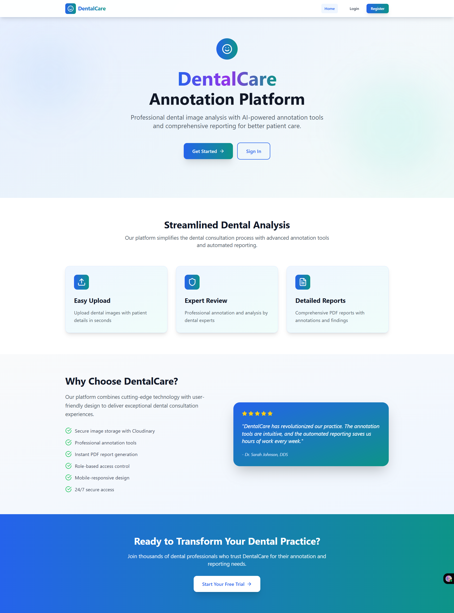
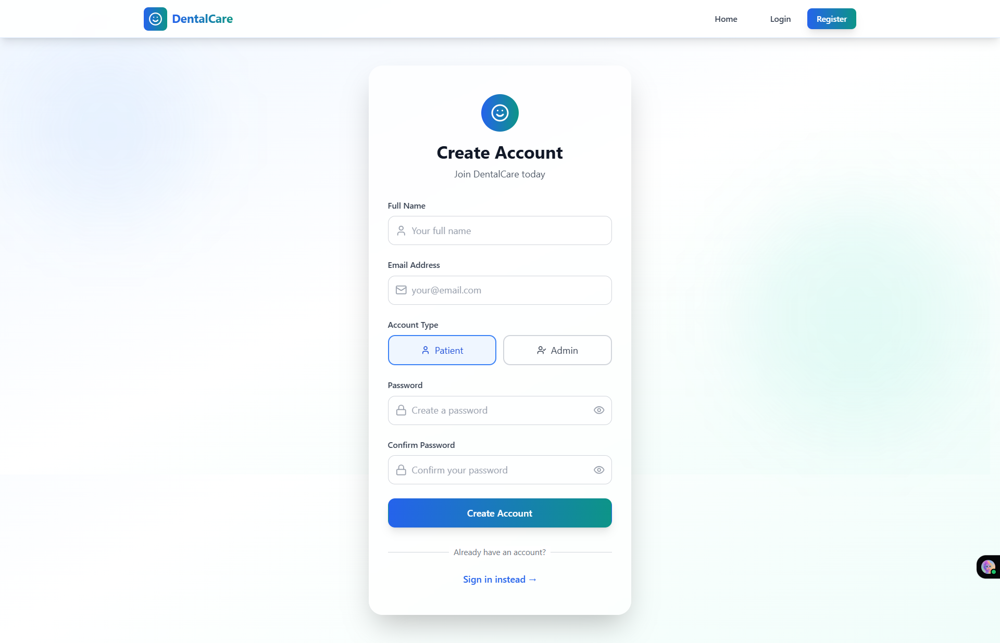
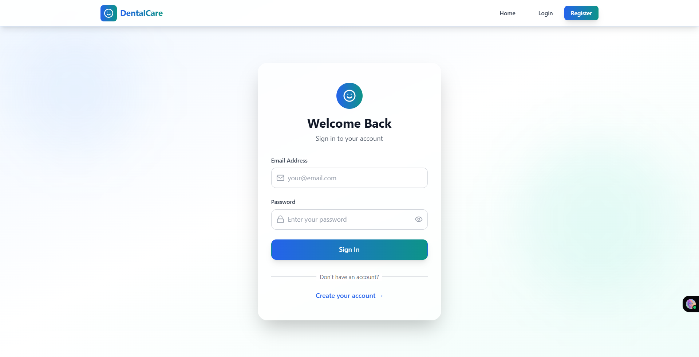
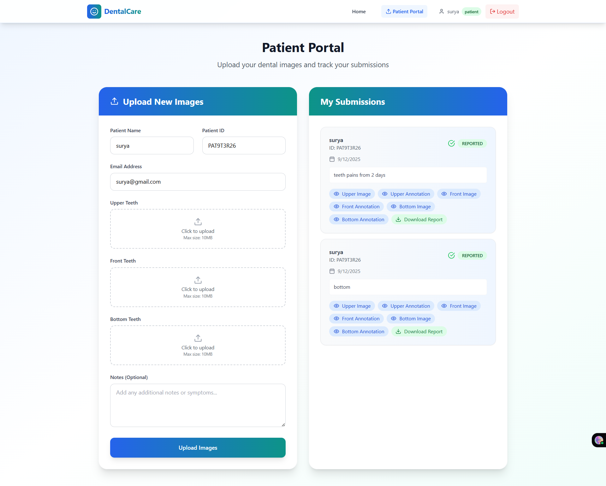
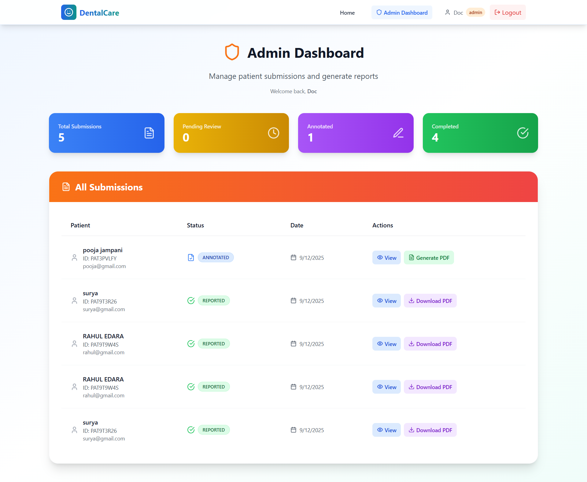
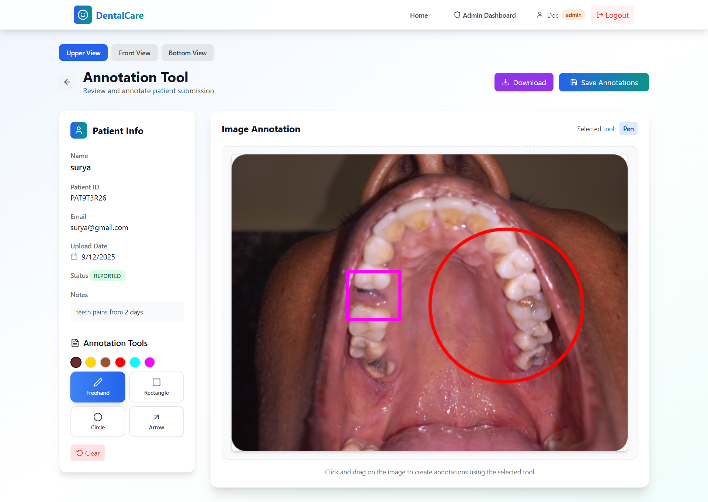
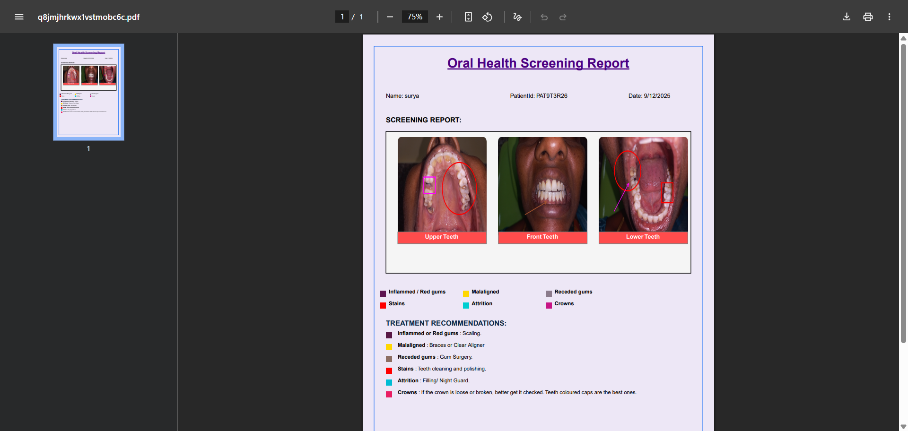

🦷 OralVis Dental Care – Full Stack App

A full-Stack Dental Care Management Digital app with a React and Node.js + Express backend, helps Patient to Connet to doctor , Assists Doctor to Annotate the Images and Generate Pdf using Pdf kit Upload to Cloudinary or AWS

## The app is deployed with Vercel (frontend) and Render (backend).

## 🚀 Live Demo

Live Link(Vercel): https://dental-care-nu-seven.vercel.app/

Backend(Render): [Dental Care API](https://dental-care-ad5g.onrender.com)

## 🦷 Admin login Sample - Use this for Sample Admin login

email : doctor@gmail.com  
password : SaiGanesh@12345

Patient Id- Unique id Automatically generated by APP

## ⚙️ Tech Stack

Frontend: React, Vite, React Router, Axios, Framer Motion, Lucide React, React Hot Toast

Backend: Node.js, Express.js, MongoDB, Mongoose, dotenv, CORS

Hosting: Vercel (frontend) & Render (backend)

## 📸 Screenshots

Hero page -

Register - New Users Rgeistration - Admin or Patient

Login page - User Login page

Patient portal -Patient uploads the Images for Doctors Annotation

Admin Dashboard - only for Admin users - shows the data of patients and helps to generate pdf ,Review Submission

Annotation tool - Helps admin to Annotate the Patient reports

PDF Generator - Using Pdf Tool kit and Cloudinary saves the pdf dynamically and generates PDf

## 🛠️ Setup Instructions --

git clone https://github.com/yourusername/dental-care.git
cd dental-care

## Backend Setup

cd backend
npm install

## Create a .env file in /backend Setup Cloduinary credentials :

MONGODB_URI=mongodb+srv://suryadammalapadb_use**\*\***8@oralcare.f87yc.mongodb.net/Oralvis
PORT=5000 (sample)
JWT_SECRET=Oralvis-super-secure-jwt-secret-key-this-production
CLOUDINARY_CLOUD_NAME=sur**\*
CLOUDINARY_API_KEY=85112**\*\***\*
CLOUDINARY_API_SECRET=LMLAbH0000**\*\*\*

## Run in development:

npm run dev

## Run in production:

npm start

## Frontend Setup

cd frontend
npm install

## Create a .env file in /frontend:

VITE_API_URL=http://localhost:5000/api

## Run in development:

npm run dev

# API endPoints

## AUTH :

Login - api.post("/auth/login")
demo : emial : surya@gmail.com pass : surya@12345

Register : api.post("/auth/register")
Role : Admin or Patient

Logout : api.post("/auth/logout") - Clear user and Logout

## User Submission end points

Fetch user submissions -
api.get("/submissions/my-submissions")

Post User Images to Annotate
api.post("/submissions")

Get submissions by ID
api.get("/:id")

## Admin End Points

Fetch All Users Submissions
api.get("/admin/submissions");

Generate PDF by Admin
api.post(`/admin/generate-pdf/${submissionId}`);

Admin Annotation with Patient ID

api.post("admin/annotate/:id")
